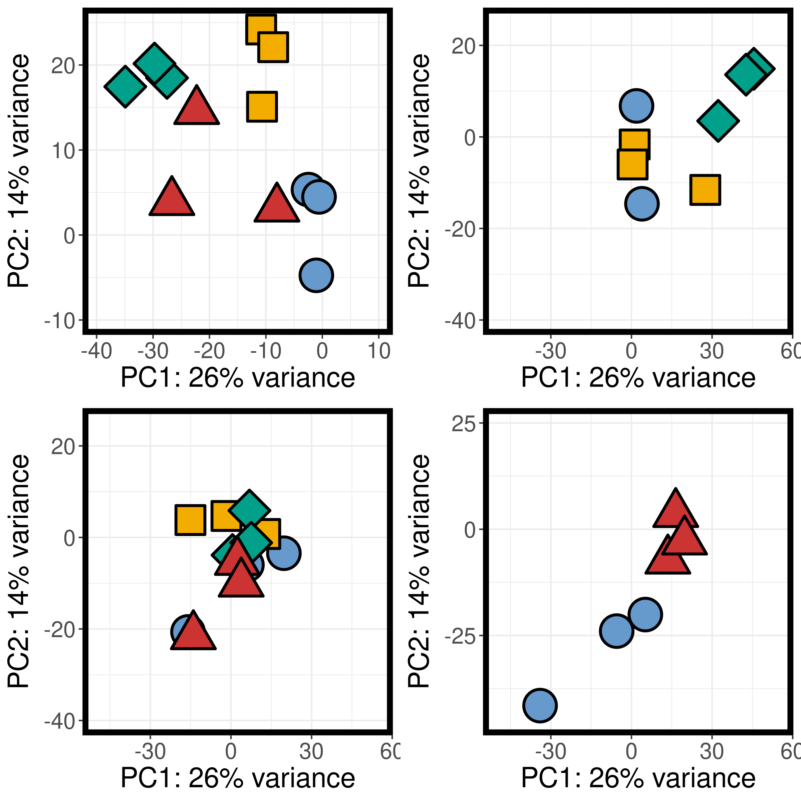

# Transcriptomics Notebook

**Course**: Intro to Ecological Genomics - Fall 2026

**Name**: Lisa Mathews

------------------------------------------------------------------------

## 9.15.2026 - Setting up lab notebook and learning markdown

-   Setting up transcriptomics notebook

-   Learn how to take notes in markdown

-   Push notes to github

**Working Directory**

`/gpfs1/home/l/d/ldmathew/projects/eco_genomics_2026/transcriptomics`

**Input Files**:

`None`

**Output Files**:

`/gpfs1/home/l/d/ldmathew/projects/eco_genomics_2026/transcriptomics/transcriptomics_notebook.md`

**Programs and dependencies**:

-   `R version 4.5.1`

-   `R-Studio`

**Scripts**:

`none`

**Code**:

``` r

print("Hello World")
```

**table**:

#/table

| Col1 | Col2 | Col3 |
|------|------|------|
|      |      |      |
|      |      |      |
|      |      |      |

**Image**:

#/image


**Notes/Observations**:

-   interpretation blahblahblah

**Next steps:**

-   next project!

------------------------------------------------------------------------

## 9.17.2026 - Introduce Study System

-   Learning how to locate .fq files in biol3990 folder through the VACC shell access

**Output Files**:

`None`

**Programs and dependencies**:

-   `VACC Shell access`

**Code:**

prints directory for transcriptomics folder

```{r}
ll | cd CleanData/ 
```

unzips big file and shows first 4 lines (avoids overloading VACC)

```{r}
zcat filename | head -n 4/
```

counts number of lines in the file

```{r}
zcat filename | wc -l
```

**Next steps:**

test for differential expression with fastq data

------------------------------------------------------------------------

## 9.22.2026 - Day 3 of Transcriptomics

Today we set up our R working file to look at A. hutsonica DESeq data

-   Got set up with your Rstudio working environment, repo, data files, and script

-   Continued working in .rmd file to keep your differential gene expression analysis notes together and annotated

-   Imported the counts matrix into DESeq2

-   Visualized reads and variation

-   Visualized global variation in gene expression using Principal Component Analysis (PCA)

**Working Directory**

`/gpfs1/home/l/d/ldmathew/projects/eco_genomics_2026/transcriptomics/myscripts`

**Input Files**:

`salmon.isoform.counts.matrix.filteredAssembly`

`ahud_samples_R.txt`

**Output Files**:

`/myresults/PCA_allGens.png`
`ahud_DESeq2 inclass.R`

**Programs and dependencies**:

-   `R version 4.5.1`

-   `R-Studio`

**Scripts**:

`ahud_DESeq2 inclass.R`

**Code**:

Remove all genes with counts \< 15 in more than 75% of samples (genes w/ too few reads)

```{r}
dds <- dds[rowSums(counts(dds) >= 15) >= 28,]
```

Runs DESeq function

``` {r}
dds <- DESeq(dds)
````

Log 2 (n+1) and variance stabalizing transformation graphs

```{r}
ntd <- normTransform(dds)
meanSdPlot(assay(ntd))

vsd <- vst(dds, blind=FALSE)
meanSdPlot(assay(vsd))
```

Heatmap of sample distance/dissimilarity

```{r}
sampleDists <- dist(t(assay(vsd)))

library("RColorBrewer")
sampleDistMatrix <- as.matrix(sampleDists)
rownames(sampleDistMatrix) <- paste(vsd$line, vsd$generation, sep="-")
colnames(sampleDistMatrix) <- NULL
colors <- colorRampPalette( rev(brewer.pal(9, "Blues")) )(255)
pheatmap(sampleDistMatrix,
         clustering_distance_rows=sampleDists,
         clustering_distance_cols=sampleDists,
         col=colors)
```

Cluster tree that looks for outliers

```{r}sampleTree <- hclust(dist(sampleDists), method="average")}
plot(sampleTree, main="Sample clustering to detect outliers", sub="", xlab="",cex.lab=1.5, cex.axis=1.5, cex.main=2)

```

Transform the data for plotting using variance stabilization

```{r}
vsd <- vst(dds, blind=FALSE)

pcaData <- plotPCA(vsd, intgroup=c("line","generation"), returnData=TRUE)
percentVar <- round(100 * attr(pcaData,"percentVar"))

ggplot(pcaData, aes(PC1, PC2, color=line, shape=generation)) +
  geom_point(size=3) +
  xlab(paste0("PC1: ",percentVar[1],"% variance")) +
  ylab(paste0("PC2: ",percentVar[2],"% variance")) + 
  coord_fixed(

```

... Then made lots of PCA plots using ggplot

**PCA Plots:**

{width="442"}

**Notes/Observations**:

-   PCA:
    -   After 4 generations, all treatments basically synced physiology
    -   After 11 generations, OWA shifted physiology

**Next steps:**

-   Explore the data with more visualizations
-   Plot individual genes
-   Run another model to focus within generation F0 between treatments
-   Make a heat map of the top differentially expressed genes

------------------------------------------------------------------------

## 9.24.2026 - Reviewing R coding and Bash Basics

-   Going over bash commands used last week
-   Reviewing A.hudsonica code

**Working Directory**

`/gpfs1/home/l/d/ldmathew/projects/eco_genomics_2026/transcriptomics/myscripts`

**Input Files**:

`None`

**Output Files**:

`/gpfs1/home/l/d/ldmathew/projects/eco_genomics_2026/transcriptomics/transcriptomics_notebook.md`

**Programs and dependencies**:

-   `R version Tidyverse 4.5.1`

-   `R-Studio`

**Scripts**:

`ahud_DESeq2 inclass.R`


**Code**:

*bash*
Print working directory
`pwd`

Change working directory
`cd`
  Move back directory
  `..`
  Home directory shortcut
  `~`
List long (includes file info)
`ll`

Print all code entered/changed during session
`history`

Copy
`cp`

Remove
`rm`
  *This is permanent!

Unzip file (prints whole file)
`zcat`


*ahud working script*

Shows output dimensions

``` r
dim()
```

{width="442"}

**Notes**:

-   Much of A.hud code included in 9-22 notebook entry
-   All bash commands pertain to terminal coding

**Next steps:**

-   Continue processing + visualizing A.hud data

------------------------------------------------------------------------
